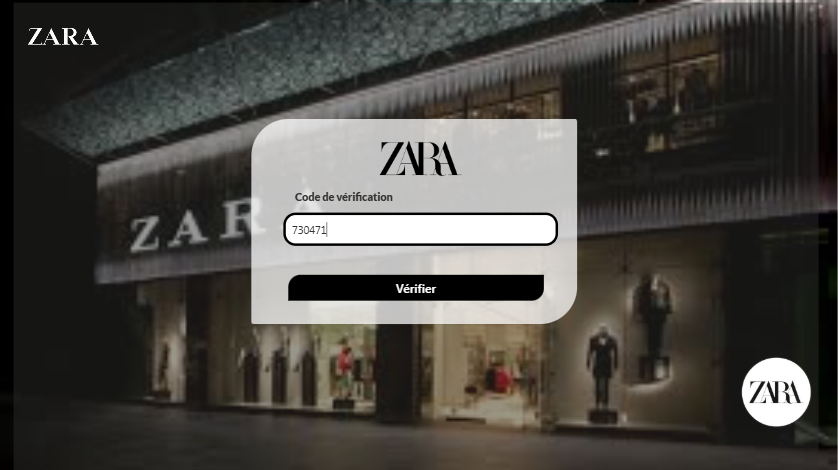
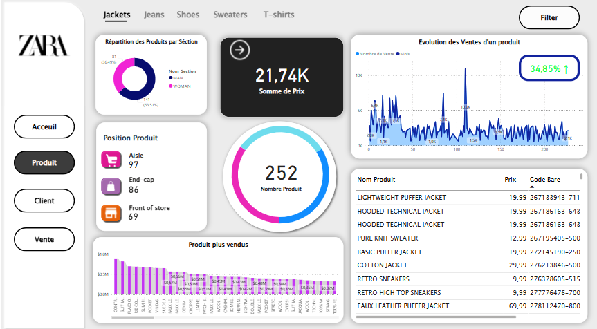
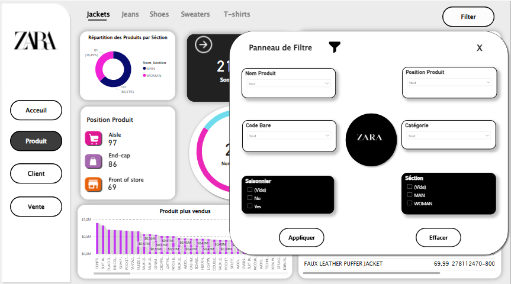
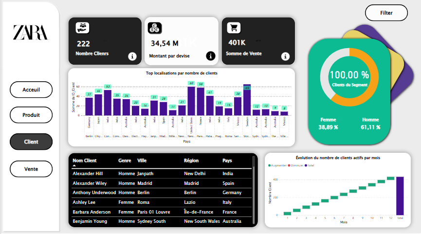

# sales-analysis-powerplatform
Système d’analyse sécurisé des ventes avec Power Platform, SSIS et Power BI

Ce projet présente une application complète développée avec **Power Apps**, **Power Automate**, **Power BI** et **SSIS**, permettant l’authentification sécurisée via OTP et la visualisation des ventes par rôle utilisateur.

## ✨ Fonctionnalités

- Authentification par email et code OTP (Power Automate + SharePoint)
- Connexion à un tableau de bord Power BI filtré par rôle utilisateur
- Intégration SQL Server avec SSIS pour l’automatisation des données
- Sécurité via RLS (Row Level Security) dans Power BI

## 📸 Aperçu de l'application

### Acceuil

### Écran de connexion

### Vérification du code

### Tableau de bord Power BI
### Acceuil

### Dashboard Produit

### Filtre

### Dashboard Client

### Dashboard Vente

### Dashboard Vente Détails

### Démonstration

## 🛠️ Technologies utilisées

- Power Apps
- Power Automate
- Power BI
- SharePoint
- SSIS
- SQL Server
- GitHub

## 👩‍💻 Réalisé par

Ikram ESSADIQ  
Étudiante en ingénierie des systèmes d'information et Big Data
